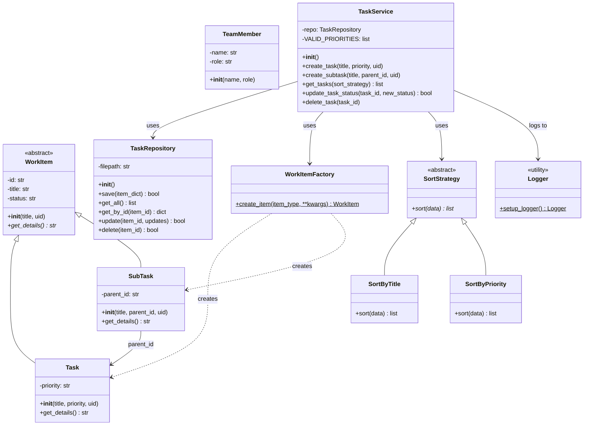
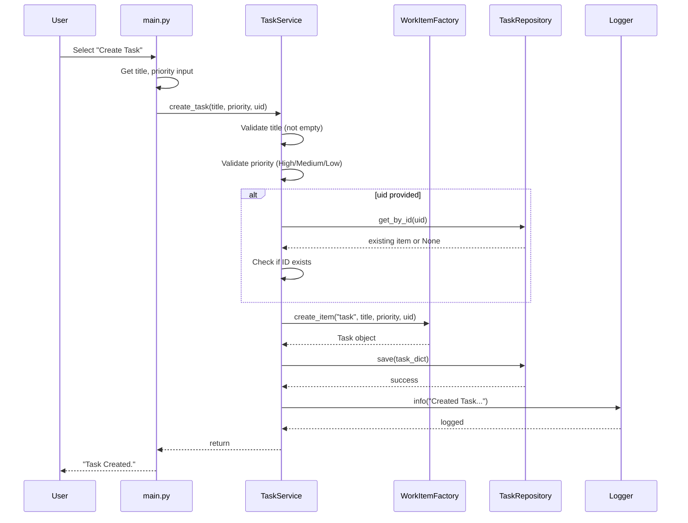
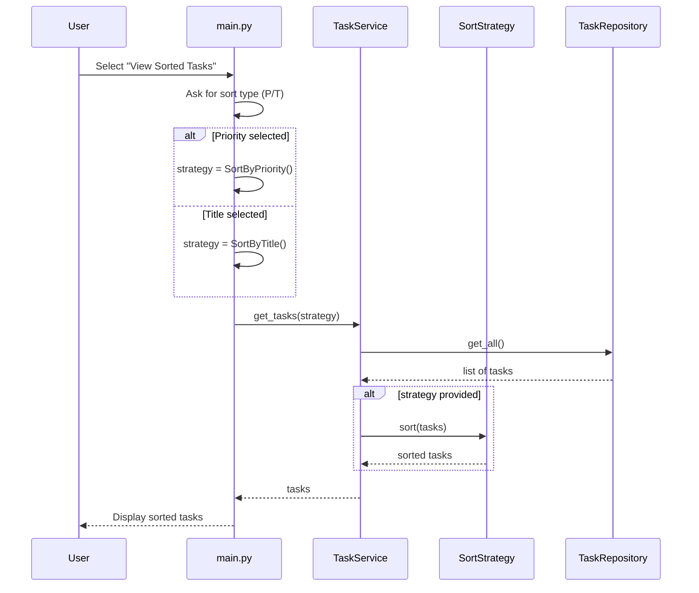
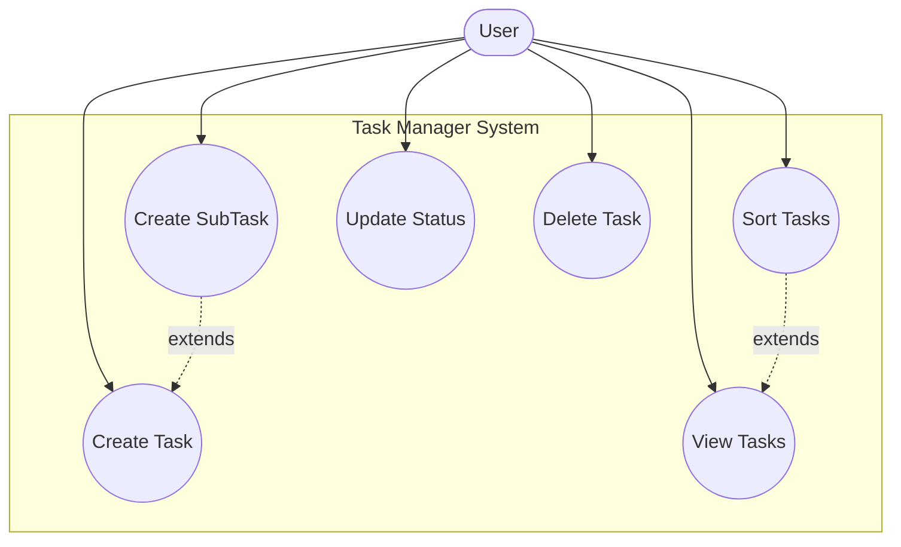
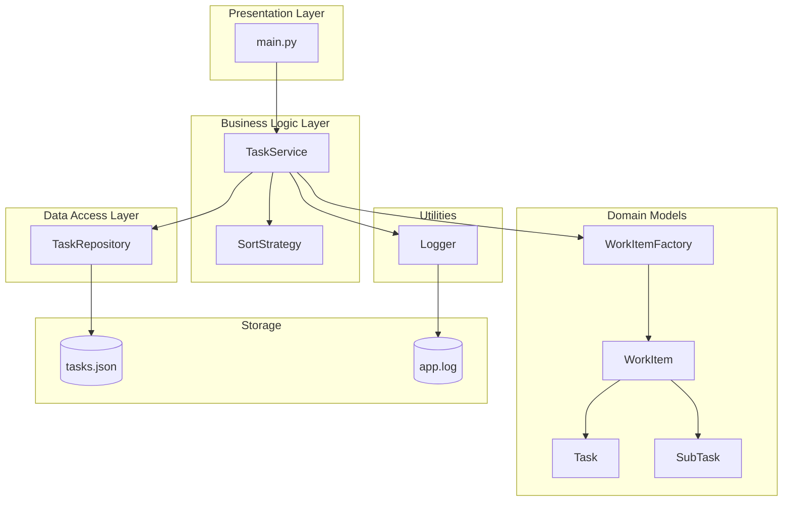

# UML Diagrams (Mermaid)

## Class Diagram

```mermaid
classDiagram
    direction TB

    class WorkItem {
        <<abstract>>
        -id: str
        -title: str
        -status: str
        +__init__(title, uid)
        +get_details()* str
    }

    class Task {
        -priority: str
        +__init__(title, priority, uid)
        +get_details() str
    }

    class SubTask {
        -parent_id: str
        +__init__(title, parent_id, uid)
        +get_details() str
    }

    class TeamMember {
        -name: str
        -role: str
        +__init__(name, role)
    }

    class WorkItemFactory {
        +create_item(item_type, **kwargs)$ WorkItem
    }

    class TaskRepository {
        -filepath: str
        +__init__()
        +save(item_dict) bool
        +get_all() list
        +get_by_id(item_id) dict
        +update(item_id, updates) bool
        +delete(item_id) bool
    }

    class TaskService {
        -repo: TaskRepository
        -VALID_PRIORITIES: list
        +__init__()
        +create_task(title, priority, uid)
        +create_subtask(title, parent_id, uid)
        +get_tasks(sort_strategy) list
        +update_task_status(task_id, new_status) bool
        +delete_task(task_id)
    }

    class SortStrategy {
        <<abstract>>
        +sort(data)* list
    }

    class SortByTitle {
        +sort(data) list
    }

    class SortByPriority {
        +sort(data) list
    }

    class Logger {
        <<utility>>
        +setup_logger()$ Logger
    }

    %% Inheritance
    WorkItem <|-- Task
    WorkItem <|-- SubTask
    SortStrategy <|-- SortByTitle
    SortStrategy <|-- SortByPriority

    %% Associations
    TaskService --> TaskRepository : uses
    TaskService --> WorkItemFactory : uses
    TaskService --> SortStrategy : uses
    TaskService --> Logger : logs to
    WorkItemFactory ..> Task : creates
    WorkItemFactory ..> SubTask : creates
    SubTask --> Task : parent_id
```

---

## Sequence Diagram: Create Task

```mermaid
sequenceDiagram
    participant User
    participant main as main.py
    participant Service as TaskService
    participant Factory as WorkItemFactory
    participant Repo as TaskRepository
    participant Log as Logger

    User->>main: Select "Create Task"
    main->>main: Get title, priority input
    main->>Service: create_task(title, priority, uid)
    
    Service->>Service: Validate title (not empty)
    Service->>Service: Validate priority (High/Medium/Low)
    
    alt uid provided
        Service->>Repo: get_by_id(uid)
        Repo-->>Service: existing item or None
        Service->>Service: Check if ID exists
    end
    
    Service->>Factory: create_item("task", title, priority, uid)
    Factory-->>Service: Task object
    
    Service->>Repo: save(task_dict)
    Repo-->>Service: success
    
    Service->>Log: info("Created Task...")
    Log-->>Service: logged
    
    Service-->>main: return
    main-->>User: "Task Created."
```

---

## Sequence Diagram: Get Tasks (Sorted)

```mermaid
sequenceDiagram
    participant User
    participant main as main.py
    participant Service as TaskService
    participant Strategy as SortStrategy
    participant Repo as TaskRepository

    User->>main: Select "View Sorted Tasks"
    main->>main: Ask for sort type (P/T)
    
    alt Priority selected
        main->>main: strategy = SortByPriority()
    else Title selected
        main->>main: strategy = SortByTitle()
    end
    
    main->>Service: get_tasks(strategy)
    Service->>Repo: get_all()
    Repo-->>Service: list of tasks
    
    alt strategy provided
        Service->>Strategy: sort(tasks)
        Strategy-->>Service: sorted tasks
    end
    
    Service-->>main: tasks
    main-->>User: Display sorted tasks
```

---

## Use Case Diagram

```mermaid
flowchart TB
    subgraph System["Task Manager System"]
        UC1((Create Task))
        UC2((Create SubTask))
        UC3((View Tasks))
        UC4((Sort Tasks))
        UC5((Update Status))
        UC6((Delete Task))
    end

    User([User])
    
    User --> UC1
    User --> UC2
    User --> UC3
    User --> UC4
    User --> UC5
    User --> UC6
    
    UC2 -.->|extends| UC1
    UC4 -.->|extends| UC3
```

---

## Component Diagram

```mermaid
flowchart TB
    subgraph Presentation["Presentation Layer"]
        Main[main.py]
    end
    
    subgraph Business["Business Logic Layer"]
        Service[TaskService]
        Strategies[SortStrategy]
    end
    
    subgraph Data["Data Access Layer"]
        Repo[TaskRepository]
    end
    
    subgraph Models["Domain Models"]
        Factory[WorkItemFactory]
        WI[WorkItem]
        T[Task]
        ST[SubTask]
    end
    
    subgraph Utils["Utilities"]
        Log[Logger]
    end
    
    subgraph Storage["Storage"]
        JSON[(tasks.json)]
        LogFile[(app.log)]
    end
    
    Main --> Service
    Service --> Strategies
    Service --> Repo
    Service --> Factory
    Service --> Log
    Factory --> WI
    WI --> T
    WI --> ST
    Repo --> JSON
    Log --> LogFile
```
